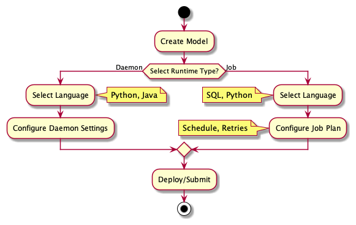

# Draft

## The model of product design

### Modeling

I want to model some data models, and then yield stream or batch processing tasks based on it. These models are stream, file, and table, respectively.

- Stream: In this model, we can determine the message schema in the stream queue and the message topic.
- File: In this model, we can determine the file name, file path, and file specification.   
- Table: In this model, we see the model as a table.

###  Programing Language

We can support these languages blow:

1. SQL
2. Python
3. Java and Scala

### Daemon and Job

We mainly provide two types of task runtime: daemon and job.

- Daemon: As a daemon, we can execute Python, Java, and Scala by launching a constant process. It often runs for stream processing.
- Job: As a job, we can execute SQL, Python, Java, and Scala. For instance, a Flink job, a Spark job, and so on. It often runs for batch processing.

### Planning

1. Planning of a Job: As we know, DAG is a good way to schedule jobs, which we can arrange the execution order of jobs and trigger times. 
2. Planning of a Daemon: There are no dependencies between daemons, so that is no planning for a daemon.

### Conclusion

