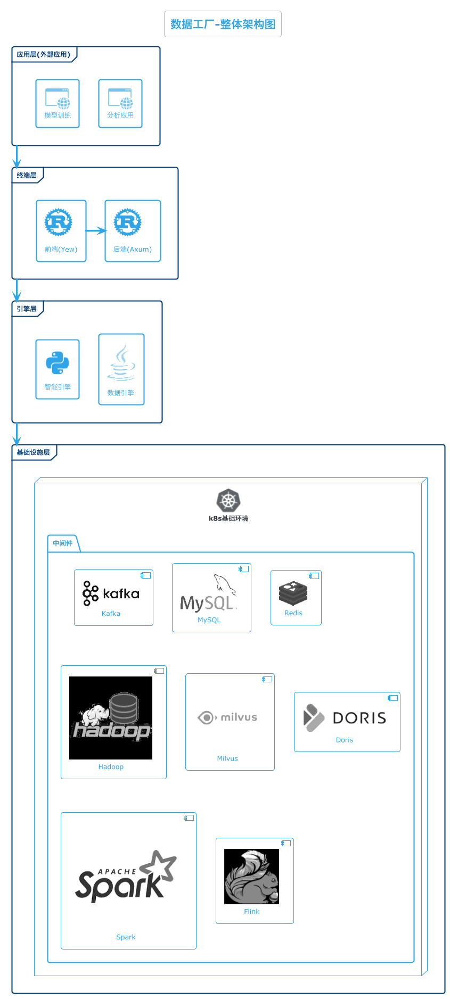
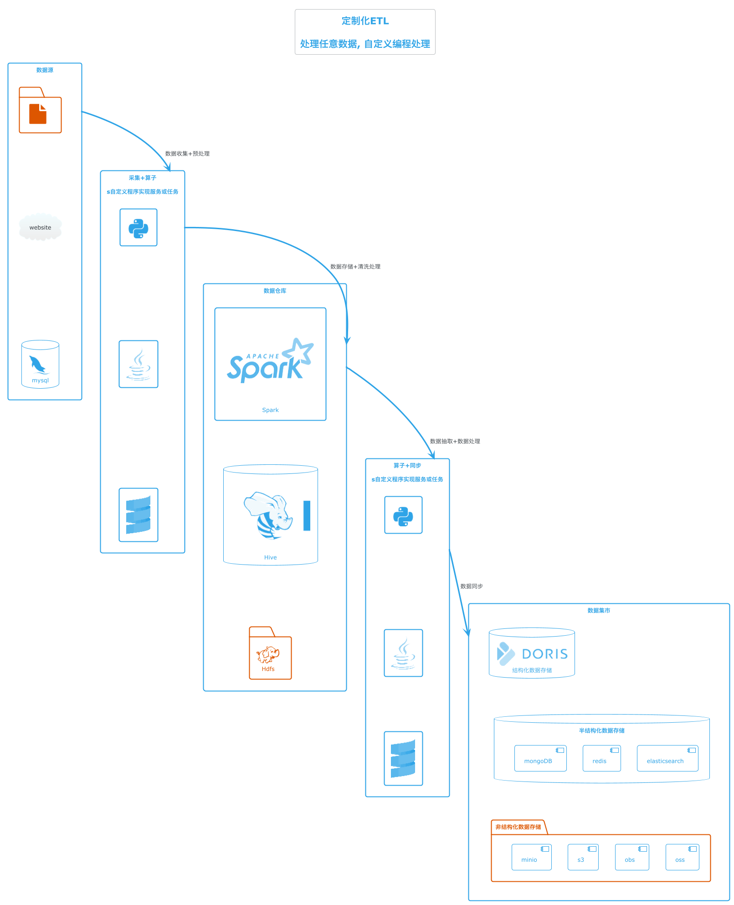

#  🏭 Data-factory

---

在大数据世界中，结构化数据、半结构化数据、非结构化数据分布在数据库、文件或网页中， 这些数据大部分是应用的运行数据，本身没有适当的上下文和意义，无法为分析直接提供数据价值。
 
因此，应用在收集数据之后往往需要对数据进行清洗、转换和集成, 即extract-load-transform (ELT)， 甚至针对模型训练型的数据还需要进行特征工程。
 
Data-factory是一个数据管理服务，它提供了一个统一的数据仓库，用于存储和管理各种类型的数据，同时提供如下功能:
- ETL任务的开发、编排和运行
- 统一元数据管理和数据血缘
- 数据查询
- 智能助手

## Overall Architecture

### data-terminal

TODO!!!

### data-engine

数据引擎标准ETL的数据链路支持

数据引擎定制化ETL的数据链路支持

### data-agent

TODO!!!

## Learn More

### 📮 installation and deployment

See how to install and deploy 🔗[Installation and deployment](./documents/installation-and-deployment/) 

